<!--
paginate: true
-->

# twelve

石川ブロック

## メンバー
* 機体担当: 辻森 律己
* プログラム担当: 川本 博詔、山崎 創、道下 航生

---

<!--
footer: twelve
-->

# 機体紹介

モジュール|オフェンス|ディフェンス
:-|:-:|:-:
メインボード|Arduino Uno|Arduino Nano
カメラ|OpenMV Cam H7|同左
地磁気|BNO055|同左
超音波|HC-SR04 3個|同左
ラインセンサー|自作|同左
液晶|1602A LCD|同左
モータードライバー|6ch MCB(DDK0668T)|同左

---

<!--
_header: 機体紹介
-->

---

# OpenMVの制御

## 試合中のループ

1. ボールおよびゴールを検知
2. 検知したもののカメラ上での座標をメインボードに送信

## 特徴

* カメラの明るさ、彩度などを手動で設定 →オブジェクトの検知に最適化
* 送信するデータ上では数値1つを2バイトで表現 →データ量を最小限に抑える

---

# 自作ラインセンサー

TODO

---

# オムニホイール

TODO

---

# LCD

今までの機体では1回1回パソコンにつながなければセンサーチェックができなかったが、常にセンサーで読み取った値やFPS?が表示されるように
→どのセンサーの値が違うために予想と異なる動きをするのか、などを楽に調べることができた。

<!-- TODO: 写真 -->

---

# 基本動作

## 1: 姿勢制御

1. 地磁気センサー(BNO055)で現在の向きが正面から何度かを取得
2. 角度の値がある値より大きい場合: ロボットが正面を向いていないため、回転させて向きを修正

<!-- TODO: 具体的な図 -->

---

<!--
_header: 基本動作
-->

## 2: アウトオブバウンズ対策

1. ラインセンサーが白線を検知したか確認
2. どれか一つでも検知した場合: 検知したラインセンサーと反対側に進む

<!-- TODO: 具体的な図 -->

---

<!--
_header: 基本動作 > 2: アウトオブバウンズ対策
-->

### オフェンス独自のアルゴリズム

1. ラインセンサーが白線を検知した場合: OpenMVで相手ゴールが正面にあるかを確認
2. 正面にあった場合は後退(ペナルティエリアへの侵入を防ぐ)
3. なかった場合はラインセンサーに応じて移動方向を決定

---

<!--
_header: 基本動作 > 2: アウトオブバウンズ対策
-->

### ディフェンス独自のアルゴリズム

<!--最初はラインセンサーと超音波センサーを使ってラインセンサーが白線を読み込んだときに超音波センサーが壁との距離をはかり、動く方向を決定する予定だった。
しかし、動画撮影当日になると、超音波センサーが値を読み込まなくなる時があり、センサーを交換するなどしてもなおらなかったため、ラインセンサーのみで読み込んだセンサーの場所によって動く方向を決めるように変えた。
読み込まなくなる条件は分かったが、-->

* 超音波使用:
    1. 超音波センサーで壁との距離を測定
    1. 30cmより小さい値がない場合: →後ろに壁があるため、前に出る
    1. 小さい値がある場合 →小さい値を読み取った側に壁があるため、反対側に動く
* 超音波不使用:
    * ラインセンサーに応じて移動方向を決定
