# twelve

石川ブロック

## メンバー
* 機体担当: 辻森 律己
* プログラム担当: 川本 博詔、山崎 創、道下 航生

---

# 機体紹介

モジュール|オフェンス|ディフェンス
:-|:-:|:-:
メインボード|Arduino Uno|Arduino Nano
カメラ|OpenMV Cam H7|同左
地磁気|BNO055|同左
超音波|HC-SR04 3個|同左
ラインセンサー|自作|同左
液晶|1602A LCD|同左
モータードライバー|6ch MCB(DDk0668T)|同左

---

