<!-- 必ずVSCodeで開き、Ctrl+Shift+Vでプレビューを開くこと -->

# robo2019

ロボカップ用に作ったArduinoライブラリです。前提条件として、機体のモーターの位置、番号、向き、そしてロボットの中心を原点とした相対座標系について、極形式の角度は次の写真のようになっているものとします。

`#include <robo2019.h>`でインクルードしてください。以下で紹介するものはすべて`robo`ネームスペースに格納されます。

Doxygen用にコメントを入れました。そっちをリファレンスにしてください。あと、`.h`ファイルと`.cpp`ファイルにできるだけ分けるようにしましたが、Arduino IDEのバグで一部リンクができなかったため、そこだけ`.h`内に書いてあります。
