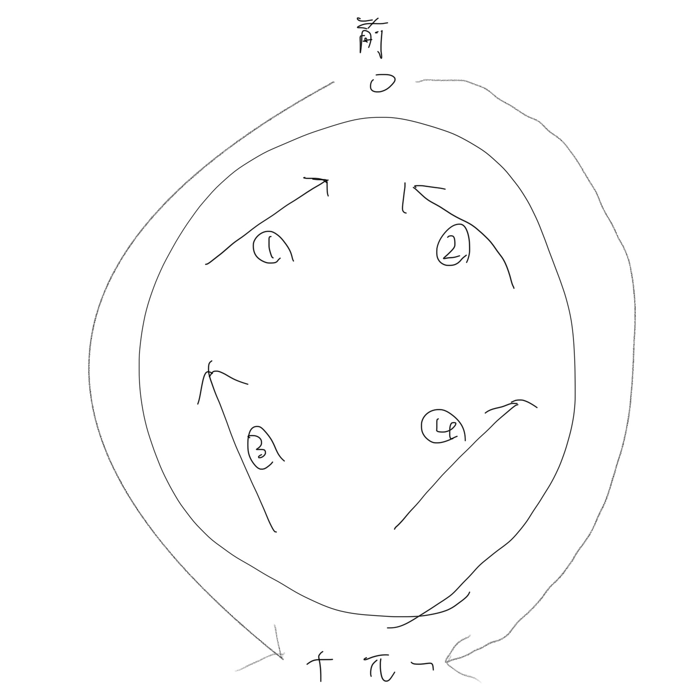

<!-- 必ずVSCodeで開き、Ctrl+Shift+Vでプレビューを開くこと -->

# robo2019

ロボカップ用に作ったArduinoライブラリです。前提条件として、機体のモーターの位置、番号、向き、そしてロボットの中心を原点とした相対座標系について、極形式の角度は次の写真のようになっているものとします。



`#include <robo2019.h>`でインクルードして下さい。以下で紹介するものは全て`robo`ネームスペースに格納されます。

## util.h

ライブラリ全体で共有するユーティリティを集めました。

`namespace string`

文字列関連の機能群です。Pythonの`str`クラスに似せて作りました。

`String string::rjust(const String &target, uint8_t width, const char &padding)`

`target`に与えられた文字列を長さ`width`に右寄せした文字列を返します。余白には`padding`に与えられた文字が使われます。`padding`が`char`型であることに注意して下さい。
例:

```C++
String s = "Hello"
s = robo::string::rjust(s, 10, '+');
// s == "+++++Hello"
```

## vec2d.h

`Vector2D<T>`

自作の2次元ベクトル型です。テンプレート引数の`T`は算術型(`int`, `double`など)である必要があります。モータ制御、pixyのボール情報などでこの型を使用しています。

**型エイリアス**

以下のエイリアスが定義されています。

* `using V2_double = Vector2D<double>;`
* `using V2_int = Vector2D<int>;`

**プロパティ**

* `T x, y`

ベクトルのx座標、y座標です。

**コンストラクタ**

* `Vector2D<T>()`

プロパティの`x`と`y`を`0`で初期化します。

* `Vector2D<T>(const T &x, const T &y)`

プロパティの`x`と`y`を、引数の`x`と`y`でそれぞれ初期化します。
例:

```C++
robo::V2_int v(2, 4);
// v.x == 2, v.y == 4
```

* `Vector2D<T>(const Vector2D<T> &p)`

引数のベクトル`p`をコピーして初期化します。

* `Vector2D<T>(const T (&p)[2])`

プロパティの`x`と`y`を、`p[0]`と`p[1]`でそれぞれ初期化します。
例:

```C++
int ls[] = {2, 4};
robo::V2_int v(ls);
// v.x == 2, v.y == 4
```

* `Vector2D<T>(std::initializer_list<T> init)`

初期化子リストです。

```C++
robo::V2_int v{2, 4};
// v.x == 2, v.y == 4
```

**演算子の実装**

`Vector2D`が実装している演算子を紹介します。

* `Vector2D<t>& operator=(const Vector2D<T> &tmp)`

コピー代入です。
例:

```C++
robo::V2_int v1(2, 4), v2(3, 5);
v1 = v2;
// v1.x == 3, v1.y == 5
```

* `Vector2D<T>& operator=(const T (&tmp)[2])`

`x`に`tmp[0]`を、`y`に`tmp[1]`を代入します。
例:

```C++
robo::V2_int v;
int ls[] = {2, 4};
v = ls;
// v.x = 2, v.y = 4
```

* `const T& operator[](size_t index) const`
* `T& operator[](size_t index)`

添字の実装です。`0`であれば`x`、`1`であれば`y`の値を返します。
例:


```C++
robo::V2_int v{2, 4};
v[0] = 3;
v[1] = 5;
// v.x == 2, v.y == 4
```

* `Vector2D<T> operator+(const Vector2D<T> &lh, const Vector2D<T> &rh)`
* `Vector2D<T> operator+(const Vector2D<T> &lh, const T (&rh)[2])`
* `Vector2D<T>& operator+=(Vector2D<T> &lh, const Vector2D<T> &rh)`
* `Vector2D<T>& operator+=(Vector2D<T> &lh, const T (&rh)[2])`

加算の実装です。
例:

```C++
robo::V2_int v1{2, 4}, v2{3, 5};
int ls[] = {6, 1};
robo::V2_int v3 = v1 + ls;
// v3.x == 8, v3.y == 5
v2 += v1;
// v2.x == 5, v2.y == 9
```

* `Vector2D<T> operator-(const Vector2D<T> &lh, const Vector2D<T> &rh)`
* `Vector2D<T> operator-(const Vector2D<T> &lh, const T (&rh)[2])`
* `Vector2D<T>& operator-=(Vector2D<T> &lh, const Vector2D<T> &rh)`
* `Vector2D<T>& operator-=(Vector2D<T> &lh, const T (&rh)[2])`

減算の実装です。
例:

```C++
robo::V2_int v1{2, 4}, v2{3, 5};
int ls[] = {6, 1};
robo::V2_int v3 = v1 - ls;
// v3.x == -4, v3.y == 3
v2 -= v1;
// v2.x == 1, v2.y == 1
```

* `Vector2D<T> operator*(const Vector2D<T> &lh, const Vector2D<T> &rh)`
* `Vector2D<T> operator*(const Vector2D<T> &lh, const T (&rh)[2])`
* `Vector2D<T> operator*(const Vector2D<T> &lh, const T &rh)`
* `Vector2D<T>& operator*=(Vector2D<T> &lh, const Vector2D<T> &rh)`
* `Vector2D<T>& operator*=(Vector2D<T> &lh, const T (&rh)[2])`
* `Vector2D<T>& operator*=(Vector2D<T> &lh, const T &rh)`

乗算の実装です。内積ではないので注意して下さい。
例:

```C++
robo::V2_int v1{2, 4}, v2{3, 5};
int ls[] = {6, 1};
robo::V2_int v3 = v1 * ls;
// v3.x == 12, v3.y == 4
v2 *= 5;
// v2.x == 30, v2.y == 5
```

* `Vector2D<T> operator/(const Vector2D<T> &lh, const Vector2D<T> &rh)`
* `Vector2D<T> operator/(const Vector2D<T> &lh, const T (&rh)[2])`
* `Vector2D<T> operator/(const Vector2D<T> &lh, const T &rh)`
* `Vector2D<T>& operator/=(Vector2D<T> &lh, const Vector2D<T> &rh)`
* `Vector2D<T>& operator/=(Vector2D<T> &lh, const T (&rh)[2])`
* `Vector2D<T>& operator/=(Vector2D<T> &lh, const T &rh)`

除算の実装です。
例: (小数の桁はテキトーです。)

```C++
robo::V2_double v1{2.0, 4.0}, v2{3.0, 5.0};
int ls[] = {6.0, 1.0};
robo::V2_double v3 = v1 / ls;
// v3.x == 0.3333333, v3.y == 4.0
v2 /= 5;
// v2.x == 0.6, v2.y == 1.0
```

**メンバ関数**

* `String Vector2D<T>::to_string() const`

ベクトルの簡易的な文字列表現を返します。
例:

```C++
robo::V2_int v{2, 4};
String s = v.to_string();
// s == "(2, 4)"
```

* `T Vector2D<T>::dot(const Vector2D<T> &v) const`
* `T Vector2D<T>::dot(const T (&tmp)[2]) const`
* `T Vector2D<T>::dot(const T &x, const T &y) const`

ベクトルの内積を計算します。
例:

```C++
robo::V2_int v{2, 4};
int ls[] = {5, 3};
int d1 = v.dot(ls), d2 = v.dot(3, 5);
// d1 == 22, d2 == 26
```

* `double Vector2D<T>::angle() const`

ベクトルの角度を計算します。原点`(0, 0)`から`(1, 0)`の向きが`0`、`(0, 1)`の向きが`PI / 2`、`(0, -1)`の向きが`-PI / 2`です。
例:

```C++
robo::V2_int v{1, 1};
double ang = v.angle();
// ang == PI / 4
```

* `double Vector2D<T>::mag() const`

ベクトルの大きさを計算します。
例: `robo::V2_int{1, 1} == sqrt(2)`

```C++
robo::V2_int v{1, 1};
double mag = v.mag();
// mag == sqrt(2)
```

## motor


