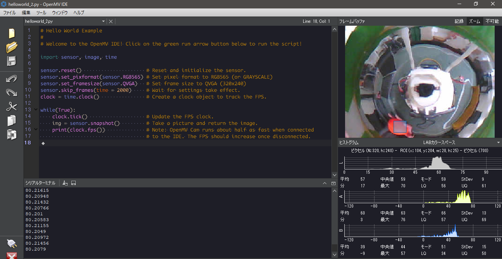

# OpenMV

https://qiita.com/qmore/items/60d2c776d4a00db5863c

この記事に書いてないことを補足する形でOpenMVの使い方を説明します。

## サンプルコードで使うもの

画面右上の「ファイル」にプログラム例のメニューがあります。私が参考になったものだけ引用しておきます。

- OpenMV
  - Basics
      - `helloworld.py` カメラの映像を表示する基本的なプログラムです。
  - Arduino
      - `arduino_i2c_slave.py` Arduinoをマスター、OpenMVをスレーブとしてI2C通信するプログラムです。
  - Color-Tracking
      - `single_color_rgb565_tracking.py` カラートラッキングのプログラムです。

## LABについて

https://www.konicaminolta.jp/instruments/knowledge/color/section2/02.html

OpenMVでカラートラッキングをする場合、LABという方式で色を表現する必要があります。LABがなんたるかについては上の記事を読んどいてください。

RGBからLABに変換するのも手間なんで、OpenMV IDEで手っ取り早くLAB値を得る方法を紹介します。

1. `helloworld.py`を実行
2. 右側のカメラ映像を拡大
3. 検知したい色がある領域を選択
    1. 領域の左上にマウスを置く
    2. 領域の右下までドラッグ
4. ヒストグラムの表示を「LABカラースペース」に変更

こんな感じです。

## VS Codeとの連携

ありません。と言うのも癪なので、無理やりですが連携(?)する方法を書いておきます。

1. VS Codeで`.py`のファイルを開く
2. VS Codeの**ワークスペース**設定を変更する(ユーザー設定ではない)
    - `Python: Language Server`を`none`にする(VS Codeを再起動)
3. OpenMV IDEでVS Codeで開いたファイルを開く

これで完了です。VS Codeでファイルを編集して保存すると、OpenMV側でファイル更新のポップアップが表示されます。

ちなみに、VS Codeの設定を変更したのでコードの補完ができません。

## さいごに

このフォルダーの中身にも触れておきます。

`impl2`にはRCJ参加時のOpenMVのプログラムと、Arduino側のサンプルコードがあります。

`impl3`は割り込みを使って何とか高速化しようとした結果です。失敗しました。
